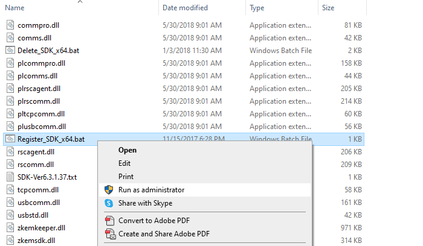

# Description

  

This project is made to test ZKTeco Software Development Kit (SDK) if it can connect the ZKTeco Biometric Device.

  

# Installation

1. Clone the repository

2. Open the "dll" folder and run "Register_SDK_x64.bat" as an Administrator



3. Open Command Prompt as Administrator and enter 
```
regsvr32 "C:\Path\To\zkemkeeper.dll"
```

4. Add "zkemkeeper" in the Reference


5. Update the IP Address and Port with the IP Address and Port of your Biometric Device
```
string deviceIp = "192.168.15.101"; // IP address of the device
int devicePort = 4370; // Port (default 4370)
```


# Additional Resources

- [ZKTeco SDK](https://www.zkteco.com/en/SDK)
- [C# ZKTeco Biometric Device Getting Started](https://www.codeproject.com/articles/1104538/csharp-zkteco-biometric-device-getting-started)
